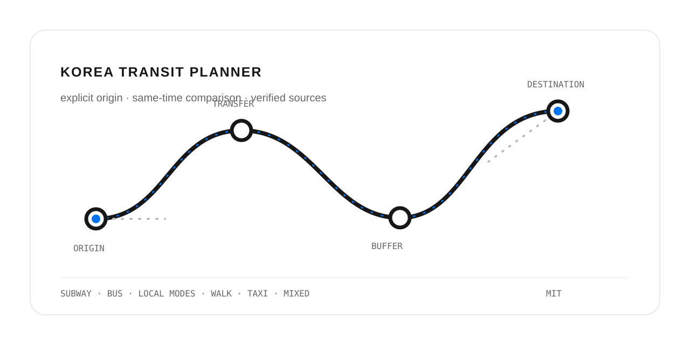

# korea-transit-planner

[](https://github.com/bohe76/korea-transit-planner-skill/actions/workflows/ci.yml)
[](LICENSE)



A Korean-first agent skill for comparing door-to-door transit routes in Korea on one time basis.

`korea-transit-planner` is a reusable research procedure for ordinary subway, city/intercity bus, village bus, Nuri Bus/DRT, walking, taxi, and mixed routes. It uses map services for route candidates, then distinguishes them from official schedule and fare evidence.

> **Procedure skill, not a routing engine.** It contains no API keys, private addresses, personal calendar data, transit dataset, or map tiles.

[Korean README](README.md) · [Install](#install-with-hermes-agent) · [Example request](#example-request) · [Verification and privacy](#verification-and-privacy) · [Contributing](CONTRIBUTING.md)

## Guarantees and boundaries

- The origin must be supplied by the user; no saved home address or personal default is inferred.
- User-named boarding and alighting stations are hard constraints.
- Candidate routes are compared door-to-door against the same departure or arrival time basis.
- Volatile facts carry a check time and time zone; estimates are labeled as estimates.
- **GTX is strictly opt-in:** it is researched or compared only when the user explicitly says `GTX` or names a GTX station.

## Install with Hermes Agent

Inspect before installing:

```bash
hermes skills inspect bohe76/korea-transit-planner-skill/korea-transit-planner
```

Then install:

```bash
hermes skills install bohe76/korea-transit-planner-skill/korea-transit-planner
```

Or use the direct `SKILL.md` URL:

```bash
hermes skills install https://raw.githubusercontent.com/bohe76/korea-transit-planner-skill/main/korea-transit-planner/SKILL.md
```

For current Hermes documentation, see <https://hermes-agent.nousresearch.com/docs/user-guide/features/skills>.

## Use with Codex and Claude Code

This repository uses the Agent Skills format: a `SKILL.md` plus reference files. **Only Hermes Agent installation has been exercised for this repository.** The Codex and Claude Code directions below follow their official local-skill documentation; they do not claim that a repository URL is a one-click installation for every product.

### Codex

The [official Codex Skills documentation](https://developers.openai.com/codex/skills) says Codex discovers skill folders in repository `.agents/skills/` locations and in `~/.agents/skills/` for a user-wide scope. Clone this repository, then copy or symlink the skill directory itself:

```bash
git clone https://github.com/bohe76/korea-transit-planner-skill.git
mkdir -p ~/.agents/skills
cp -R korea-transit-planner-skill/korea-transit-planner ~/.agents/skills/
```

For project-only use, place that folder at `<project>/.agents/skills/korea-transit-planner/` and launch Codex within that project. `$skill-installer` is Codex’s built-in installation helper, but this public repository has not been live-tested as a `$skill-installer` source. For reusable distribution beyond a local/repository skill, review Codex’s plugin distribution workflow.

### Claude Code

The [official Claude Code Skills documentation](https://code.claude.com/docs/en/skills) specifies `~/.claude/skills/<skill-name>/SKILL.md` for a personal skill and `.claude/skills/<skill-name>/SKILL.md` for a project skill. This is an example standalone-skill placement:

```bash
git clone https://github.com/bohe76/korea-transit-planner-skill.git
mkdir -p ~/.claude/skills
cp -R korea-transit-planner-skill/korea-transit-planner ~/.claude/skills/
```

For a team, commit the same folder under `.claude/skills/korea-transit-planner/`. A standalone skill is discovered directly from the filesystem; a plugin/marketplace is a separate packaging and distribution mechanism that can bundle skills with agents, hooks, or MCP. This repository is not currently packaged or verified as a Claude Code plugin or marketplace entry. If that is required, follow Claude Code’s [plugin marketplace documentation](https://code.claude.com/docs/en/discover-plugins).

## Example request

```text
Origin: Busan Station. Destination: Haeundae Beach.
Compare subway, bus, and taxi for arrival by 14:00 Saturday.
Include first access, waiting, transfers, final walk, fare confidence, and a 10-minute buffer.
```

Request GTX explicitly when wanted:

```text
Origin: Seoul Station. Destination: KINTEX Exhibition Center 1.
I must alight at GTX-A KINTEX Station; compare it with ordinary subway on the same arrival basis.
```

The response should place door-to-door time, wait/transfers, walk, fare confidence, and arrival risk side by side, while separating current facts, planner candidates, and estimates. See the [fictional route-briefing structure](korea-transit-planner/examples/route-briefing.md); it contains no live transit or personal trip data.

## Verification and privacy

| Information | Preferred evidence | What the result retains |
|---|---|---|
| Schedule, fare, operating conditions | Official operator or public source | Source and check time |
| Route candidates and walking links | Map service | Candidate status; cross-check official facts |
| Traffic and dispatch waits | Currently available information | Check time, time zone, and uncertainty |

Read the detailed procedures for [map-route candidates](korea-transit-planner/references/map-routing.md), [source priority](korea-transit-planner/references/source-verification.md), [GTX opt-in](korea-transit-planner/references/gtx-routing.md), and [local modes/DRT](korea-transit-planner/references/local-modes.md).

Respect map-service terms. This repository does not redistribute scraped proprietary data or map assets. Public contributions must not include home addresses, account identifiers, calendar data, tokens, authenticated URLs, or personal preference profiles. Report a potential private-data exposure through [SECURITY.md](SECURITY.md), not a public issue.

## Development

Python 3.9+ and no external packages are required:

```bash
python scripts/validate.py .
python -m unittest discover -s tests -v
```

The validator checks structure, frontmatter, explicit-origin priority, GTX opt-in, required modes, private-string patterns, and secret patterns. GitHub Actions runs the same commands.

## Contribute

Focused pull requests—from a source correction to a regional operator reference—are welcome. Start with [CONTRIBUTING.md](CONTRIBUTING.md). Generalized, privacy-safe improvements may be released under SemVer; breaking origin, GTX, station-constraint, privacy, or output-contract changes require a major version. Releases always require maintainer review and are not automated.

## License

[MIT](LICENSE)
